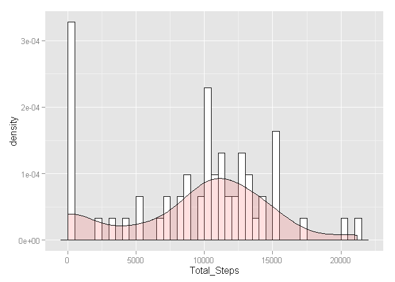
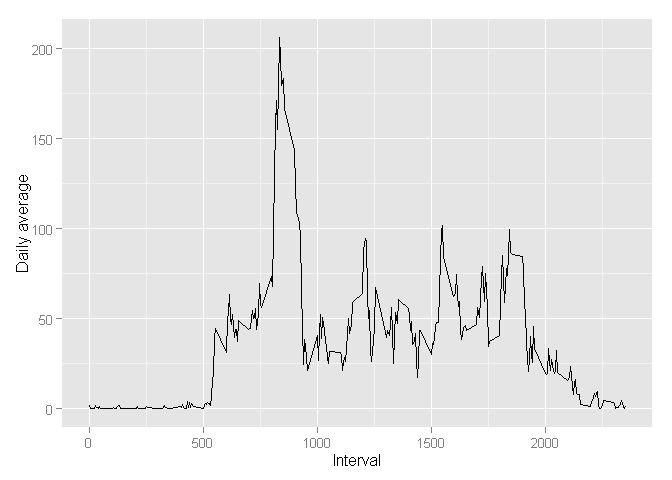
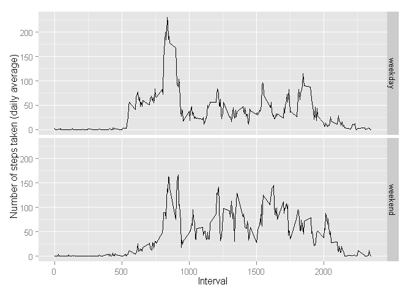

# Reproducible Research: Peer Assessment 1

This assignment aims for the analysis of activity monitoring of steps taken in 5-minute interval. Next, the process of analysis is described and R code is presented.

## Loading and preprocessing the data

The data is loaded using read.csv function. Afterthat, the date is converted from character format into date format.


```r
activity <- read.csv("activity.csv", stringsAsFactors=F)
activity$date2 <- strptime (activity$date, "%Y-%m-%d")
```


## What is mean total number of steps taken per day?

An histogram of the total number of steps taken each day is created. Therefore, the data aggregated is shown below, besides de R code chunk. The first figure shown contains a density plot in which the total number of steps is represented.


```r
attach(activity)
aggdata <-aggregate(activity$steps, by=list(date), FUN=sum, na.rm=TRUE)
print(aggdata)
```

```
##       Group.1     x
## 1  2012-10-01     0
## 2  2012-10-02   126
## 3  2012-10-03 11352
## 4  2012-10-04 12116
## 5  2012-10-05 13294
## 6  2012-10-06 15420
## 7  2012-10-07 11015
## 8  2012-10-08     0
## 9  2012-10-09 12811
## 10 2012-10-10  9900
## 11 2012-10-11 10304
## 12 2012-10-12 17382
## 13 2012-10-13 12426
## 14 2012-10-14 15098
## 15 2012-10-15 10139
## 16 2012-10-16 15084
## 17 2012-10-17 13452
## 18 2012-10-18 10056
## 19 2012-10-19 11829
## 20 2012-10-20 10395
## 21 2012-10-21  8821
## 22 2012-10-22 13460
## 23 2012-10-23  8918
## 24 2012-10-24  8355
## 25 2012-10-25  2492
## 26 2012-10-26  6778
## 27 2012-10-27 10119
## 28 2012-10-28 11458
## 29 2012-10-29  5018
## 30 2012-10-30  9819
## 31 2012-10-31 15414
## 32 2012-11-01     0
## 33 2012-11-02 10600
## 34 2012-11-03 10571
## 35 2012-11-04     0
## 36 2012-11-05 10439
## 37 2012-11-06  8334
## 38 2012-11-07 12883
## 39 2012-11-08  3219
## 40 2012-11-09     0
## 41 2012-11-10     0
## 42 2012-11-11 12608
## 43 2012-11-12 10765
## 44 2012-11-13  7336
## 45 2012-11-14     0
## 46 2012-11-15    41
## 47 2012-11-16  5441
## 48 2012-11-17 14339
## 49 2012-11-18 15110
## 50 2012-11-19  8841
## 51 2012-11-20  4472
## 52 2012-11-21 12787
## 53 2012-11-22 20427
## 54 2012-11-23 21194
## 55 2012-11-24 14478
## 56 2012-11-25 11834
## 57 2012-11-26 11162
## 58 2012-11-27 13646
## 59 2012-11-28 10183
## 60 2012-11-29  7047
## 61 2012-11-30     0
```

```r
detach(activity)

library(ggplot2)
```

```
## Warning: package 'ggplot2' was built under R version 3.1.2
```

```r
aggdata$Total_Steps <- aggdata$x
plot <- ggplot(aggdata, aes(x=Total_Steps))
plot <- plot +  geom_histogram(aes(y=..density..), binwidth = 500, colour="black", fill="white") +
    geom_density(alpha=.2, fill="#FF6666")  # Overlay with transparent density plot
print(plot)
```

 

The mean and the median of the total number of steps are calculated. Then, mean (<span style="color:red">red line</span>) and the median (<span style="color:blue">blue line</span>) are plotted in the histogram created abode.


```r
mean <- mean(aggdata$x)
median <- median(aggdata$x)

mean
```

```
## [1] 9354.23
```

```r
median
```

```
## [1] 10395
```

```r
plot <- plot + geom_vline(aes(xintercept=mean), color="red", linetype="dashed", size=1, labels = c("mean")) + geom_vline(aes(xintercept=median), color="blue", linetype="dashed", size=1, labels = c("median"))
print(plot)
```

 

## What is the average daily activity pattern?

In order to describe the average daily activity pattern, an average per interval is calculated, across all days. Further, a time series of the average calculated is plot.


```r
attach(activity)
aggdata2 <-aggregate(steps, by=list(interval), FUN=mean, na.rm=TRUE)
detach(activity)

library(ggplot2)
aggdata2$Avg_Steps <- aggdata2$x
aggdata2$Interval <- aggdata2$Group.1
plot2 <- ggplot(aggdata2, aes(Interval, Avg_Steps))
plot2 <- plot2 +  geom_line() + ylab("Daily average")
print(plot2)
```

 

The maximum number of steps on average across all days is:


```r
maximum <- max(aggdata2$Avg_Steps)
maximum
```

```
## [1] 206.1698
```

The interval with the maximum number of steps on average calculated is:

```r
Interval_WithMax <- aggdata2[aggdata2$Avg_Steps == maximum, "Interval"]
Interval_WithMax
```

```
## [1] 835
```

The maximum interval is reported in the plot below.


```r
plot2 <- plot2 + geom_vline(aes(xintercept=Interval_WithMax), color="blue", linetype="dashed", size=1) + geom_hline(aes(yintercept=maximum), color="blue", linetype="dashed", size=1)
print(plot2)
```

 

## Imputing missing values

In order to impute missing values, first the number of them are calculated. For that purpose, is.na function is used.


```r
sum(is.na(activity$steps))
```

```
## [1] 2304
```

The strategy of imputing missing values is to use the mean as a value to replate to. Next, the meann per interval is reported and the missing values will be imputed.


```r
nas <- which(is.na(activity$steps), arr.ind=TRUE)

activityWithoutNAs <- activity

for (i in 1:length(nas) ) {
activityWithoutNAs[nas[i],"steps"] <- aggdata2[activity[nas[i],"interval"] == aggdata2$Interval, "Avg_Steps"]
}
```

Total number of steps is calculated again and then it is compared with the collection that has NAs. 


```r
attach(activityWithoutNAs)
aggdata3 <-aggregate(activityWithoutNAs$steps, by=list(date), FUN=sum, na.rm=TRUE)
detach(activityWithoutNAs)

library(ggplot2)
aggdata3$Total_Steps <- aggdata3$x
plot3 <- ggplot(aggdata3, aes(x=Total_Steps))
plot3 <- plot3 +  geom_histogram(aes(y=..density..), binwidth = 500, colour="black", fill="white") +
    geom_density(alpha=.2, fill="#FF6666")  # Overlay with transparent density plot
print(plot3)
```

 

```r
mean3 <- mean(aggdata3$x)
median3 <- median(aggdata3$x)

mean3
```

```
## [1] 10766.19
```

```r
median3
```

```
## [1] 10766.19
```

```r
plot3 <- plot3 + geom_vline(aes(xintercept=mean3), color="red", linetype="dashed", size=1, labels = c("mean")) + geom_vline(aes(xintercept=median3), color="blue", linetype="dashed", size=1, labels = c("median"))

library(gridExtra)
```

```
## Warning: package 'gridExtra' was built under R version 3.1.2
```

```
## Loading required package: grid
```

```r
grid.arrange(plot, plot3, ncol=2)
```

 

As you can see above, after filling NAs with the mean per interval, the mean and the median are the same in the new dataset without NAs.

## Are there differences in activity patterns between weekdays and weekends?

Using weekdays function, we put a label on each steps counting in order to see if the day is weekday or weekend day. Afterthat, we plot a timeseries comparing data over weekdays and weekend days. We use the data imputed before.

For this purpose we use the variable date2 transformed before into POSIXlt (date format).


```r
activityWithoutNAs$weekdays <- (weekdays(activityWithoutNAs$date2, abbreviate = T))

weekendsInd <- which(activityWithoutNAs[,"weekdays"] %in% c("sáb","dom"), arr.ind=TRUE)
weekdaysInd <- which(!(activityWithoutNAs[,"weekdays"] %in% c("sáb","dom")), arr.ind=TRUE)
activityWithoutNAs[weekendsInd, "weekdayType"] <- "weekend"
activityWithoutNAs[weekdaysInd, "weekdayType"] <- "weekday"

attach(activityWithoutNAs)
aggdata4 <-aggregate(steps, by=list(interval,weekdayType), FUN=mean, na.rm=TRUE)
detach(activityWithoutNAs)

library(ggplot2)
aggdata4$Avg_Steps <- aggdata4$x
aggdata4$Interval <- aggdata4$Group.1
aggdata4$WeekdayType <- aggdata4$Group.2
plot4 <- ggplot(aggdata4, aes(Interval, Avg_Steps))
plot4 <- plot4 +  geom_line() + ylab("Number of steps taken (daily average)")
plot4 <- plot4 + facet_grid(WeekdayType~.)
print(plot4)
```

 
